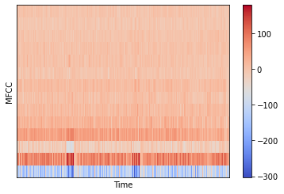

# Audio-Signal-Processing-for-Machine-Learning

This repository contains various audio signal feature extraction techniques useful for machine learning applications.
One of the import feature of Audio Signals is Mel-Frequency Coefficient

